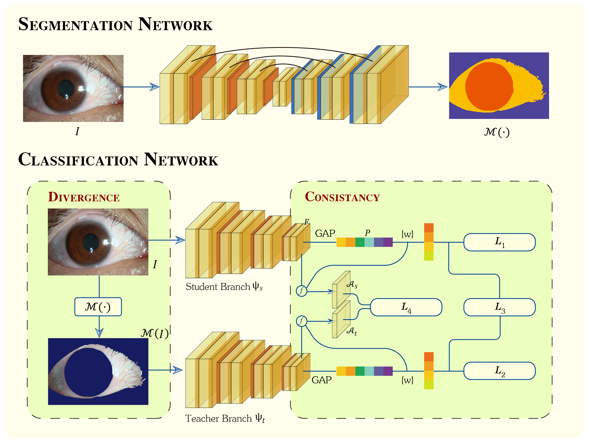

# Mask-Distrillation-Network
This is an pytorch implementation of "Mask Distillation Network for Conjunctival Hyperemia Severity Classification".

# Purpose
To achieve automatic, fast and accurate classification of bulbar conjunctival hyperemia severity, we proposed a novel “different input but same output” framework called Mask Distillation Network (MDN). 

# Methods
The proposed MDN consists of a segmentation network and a classification network with teacher-student branches. The segmentation network is used to generate a bulbar conjunctival mask and the classification network divides the severity of bulbar conjunctival hyperemia into four grades. In the classification network, we feed the original image into the student branch and feed the image with the bulbar conjunctival mask into the teacher branch, and then, an attention consistency loss and a classification consistency loss are used to keep the similar learning mode of these two branches. This design of “different input but same output”, named mask distillation (MD), aims to introduce the regional prior knowledge that “bulbar conjunctival hyperemia severity classification is only related to the bulbar conjunctiva region”.

# Network Structure

